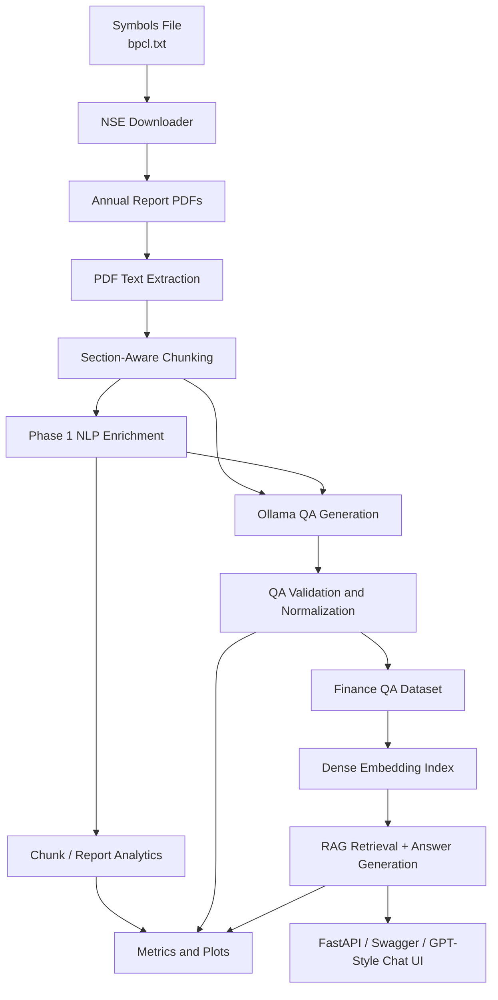
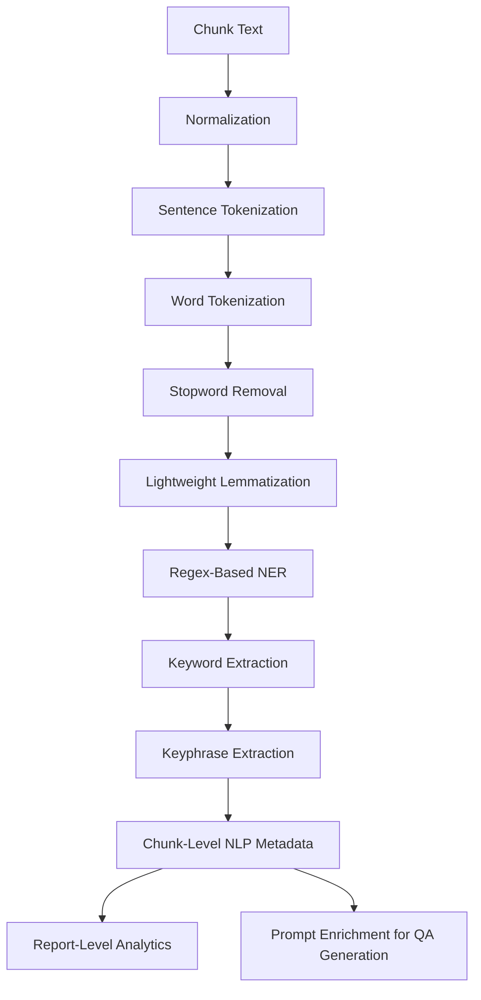

# Config-Driven End-to-End Financial QA and Local RAG Assistant from NSE Annual Reports

**Author(s):** `<Add Student Name(s)>`  
**Affiliation:** Symbiosis Institute of Technology, Pune Campus, Symbiosis International (Deemed University), Pune, India

## Abstract
This project presents a config-driven end-to-end Natural Language Processing (NLP) pipeline for transforming unstructured annual reports into a searchable financial question-answering system. The pipeline downloads annual reports from the National Stock Exchange (NSE) for company symbols listed in a text file, extracts text from PDF reports, performs chunking and Phase 1 NLP enrichment, generates finance-focused question-answer (QA) pairs using a local large language model served through Ollama, and supports downstream retrieval-augmented generation (RAG). The work emphasizes local execution, traceable document processing, reproducible output artifacts, and demonstration readiness through both command-line and FastAPI-based interfaces. In the current capstone configuration, the system is focused on BPCL annual reports over multiple financial years. The full-document analysis stage processed reports with complete chunk coverage statistics, including total PDF pages, extracted paragraphs, chunks generated, and final covered page ranges. Phase 1 NLP enrichment includes normalization, tokenization, stopword filtering, lightweight lemmatization, regex-based named entity recognition, keyword extraction, and report-level analytics. The project further produces metrics and plots for document processing, NLP analysis, QA distribution, and RAG evaluation, making it suitable for technical demonstration as well as academic reporting. The system demonstrates how financial reports can be converted into structured, queryable knowledge using practical NLP and local LLM tooling.

## Keywords
Natural Language Processing, Financial Question Answering, Retrieval-Augmented Generation, Annual Reports, Ollama, Named Entity Recognition

## 1. Introduction
Annual reports are among the richest public sources of corporate financial information. They contain management discussion, financial statements, board disclosures, capital expenditure plans, risk commentary, governance details, and sustainability commitments. However, their size and semi-structured nature make manual analysis time-consuming. Traditional keyword search is often insufficient because financial users may ask semantic questions such as “What was the standalone Profit After Tax?” or “What renewable energy targets were announced?” rather than searching exact phrases.

This capstone addresses that challenge by building a local, reproducible pipeline that converts annual reports into a financial QA dataset and a retrieval-based assistant. Instead of using cloud APIs or proprietary infrastructure, the project uses local models through Ollama and a modular Python pipeline to process reports end to end.

The major objective is to create a system that:

1. downloads annual reports from NSE-linked sources,
2. extracts and chunks PDF text,
3. enriches chunks using NLP analysis,
4. generates finance QA pairs from those chunks,
5. indexes the resulting dataset for retrieval, and
6. answers finance queries through a local RAG pipeline with a demonstration-ready API and chat interface.

The present version of the project is intentionally focused on **BPCL annual reports across multiple years**, because a deep, auditable single-company case study is stronger for capstone demonstration than a shallow multi-company crawl.

## 2. Literature Review
Classical NLP pipelines rely on preprocessing, tokenization, normalization, stopword filtering, morphological normalization, and vectorization to transform raw text into analyzable representations [1]–[3]. With the growth of semantic modeling, dense word embeddings such as Word2Vec and GloVe enabled meaningful vector representations of text [4]–[6]. Later, contextual models such as BERT and Sentence-BERT significantly improved semantic matching and retrieval [8]–[10].

For question answering, retrieval-augmented generation (RAG) has emerged as a powerful strategy that combines retrieval over an external knowledge store with answer generation [11]. Dense retrieval methods such as DPR [12] and indexing libraries such as FAISS [13], [14] made it feasible to search large text collections efficiently. In parallel, open-domain QA datasets and benchmarks such as SQuAD, TriviaQA, and HotpotQA highlighted the need for grounded evidence retrieval [15]–[18].

The current project differs from many benchmark-driven QA systems in two ways. First, it works on **financial annual reports**, which are domain-specific, lengthy, and semi-structured. Second, it prioritizes **local deployment and explainability**, using a staged pipeline that preserves chunk-level traceability from report page range to generated QA pair and retrieved answer source.

The most relevant gap in current practice is that many enterprise-style assistants either depend on proprietary cloud platforms or skip intermediate NLP analysis entirely. This capstone justifies a richer approach by combining document processing, Phase 1 NLP enrichment, QA generation, dense retrieval, and a demo-ready local interface.

## 3. Methodology

### 3.1 Dataset Description
The dataset consists of BPCL annual reports downloaded through NSE-linked report URLs. The current analysis run processed four major BPCL reports successfully and produced full-document chunk coverage statistics.

| Report | Total PDF Pages | Extracted Paragraphs | Chunks Before Capping | Chunks After Capping | Final Covered Page Range |
|---|---:|---:|---:|---:|---|
| `AR_20565_BPCL_2021_2022_02082022122506.pdf` | 436 | 16,351 | 460 | 460 | 432-436 |
| `AR_22626_BPCL_2022_2023_03082023164143.pdf` | 474 | 13,899 | 433 | 433 | 470-473 |
| `AR_24874_BPCL_2023_2024_08082024182921.pdf` | 217 | 12,052 | 569 | 569 | 217 |
| `AR_27205_BPCL_2024_2025_A_31072025203857.pdf` | 236 | 13,295 | 616 | 616 | 234-236 |

These statistics are especially important because they show that the analysis stage is processing the **full document**, not just a small subset of pages.

### 3.2 Tools and Libraries Used

| Component | Tool/Library | Role |
|---|---|---|
| Programming language | Python | Pipeline implementation |
| PDF extraction | `pdfplumber` | Text extraction from annual reports |
| Local LLM serving | Ollama | QA generation, embeddings, answer generation |
| Embeddings | `nomic-embed-text` | Dense vector encoding |
| Progress tracking | `tqdm` | Live progress bars |
| Numerical processing | NumPy | Embedding matrix operations |
| API framework | FastAPI | Local API for demo and testing |
| Frontend demo | HTML/CSS/JavaScript | GPT-style chat UI |
| Plot generation | Matplotlib | Metrics and evaluation graphs |

### 3.3 System Architecture
The system is designed as a modular document-intelligence pipeline. Each stage produces artifacts that can be inspected independently, which improves explainability and makes the project easier to defend academically.



### 3.4 Overall Workflow


### 3.5 Phase 1 NLP Techniques Flow
To strengthen the project as a full NLP system rather than only an LLM wrapper, the current pipeline includes a Phase 1 enrichment layer before or alongside QA generation.



### 3.6 Detailed NLP Techniques Used
The following NLP techniques are currently integrated:

1. **Text normalization**
   Lowercases or standardizes noisy characters, repairs common mojibake patterns, and removes control characters.

2. **Sentence tokenization**
   Splits chunk text into sentence-like units for chunk-level statistics.

3. **Word tokenization**
   Splits text into lexical tokens for term analysis and keyword extraction.

4. **Stopword removal**
   Removes frequent function words for cleaner analytical term frequency.

5. **Lightweight lemmatization**
   Applies rule-based suffix normalization to approximate base word forms.

6. **Regex-based NER**
   Extracts entities such as:
   - organizations,
   - persons,
   - money values,
   - percentages,
   - dates,
   - project names.

7. **Keyword extraction**
   Uses token statistics and finance-term boosting to identify informative terms.

8. **Keyphrase extraction**
   Extracts frequent two-word finance phrases from chunk text.

9. **Section-aware chunking**
   Uses regex section detection and overlapping chunk formation.

10. **Dense retrieval and RAG**
   Uses local embeddings and retrieved context for grounded answer generation.

### 3.7 Current Phase 1 NLP Findings
The current aggregated analysis over BPCL reports produced the following top keywords:

| Keyword | Frequency |
|---|---:|
| company | 416 |
| crore | 415 |
| year | 413 |
| bpcl | 369 |
| gas | 353 |
| refinery | 304 |
| financial | 293 |
| director | 292 |
| corporation | 251 |
| project | 242 |

The current top extracted entities include:

**Organizations**
- BPCL
- Government of India
- BPRL
- BORL
- Kochi Refinery
- Bina Refinery

**Dates**
- 2023-24
- 2024-25
- 2022-23
- 2021-22
- FY 2023-24
- FY 2024-25

**Projects**
- Net Zero
- City Gas Distribution
- Project Aspire
- Project Anubhav
- Ethylene Cracker

These outputs strengthen the project academically because they show that the system is not only generating answers, but also extracting interpretable financial signals from the reports.

### 3.8 Model / Workflow Logic
The workflow used for full analysis and controlled QA generation is:

```text
Input: BPCL annual reports, config.yaml
Output: enriched QA dataset, RAG index, metrics, plots

1. Read BPCL symbol from the configured symbol file.
2. Download annual reports from NSE-linked URLs.
3. Extract report text using PDF text extraction.
4. Detect section boundaries and collect valid paragraphs.
5. Form overlapping chunks using approximate token limits.
6. Record report-level processing statistics:
   - total pages
   - extracted paragraphs
   - chunks before capping
   - chunks after capping
   - final covered page range
7. Run Phase 1 NLP enrichment on each chunk.
8. Export chunk-level and report-level NLP analytics.
9. Generate finance QA pairs using the local Ollama generation model.
10. Validate, normalize, and deduplicate QA pairs.
11. Build dense embeddings for the final QA dataset.
12. Retrieve top-k relevant items for user questions.
13. Generate final answers using grounded retrieved context.
14. Export metrics and plots for reporting and demonstration.
```

### 3.9 Training and Testing Process
This project does not perform supervised fine-tuning. Instead, it uses pre-trained local models served via Ollama for:

1. QA generation,
2. dense embeddings,
3. answer generation.

Thus, the testing process is organized as:

1. document processing verification,
2. NLP enrichment analysis,
3. QA dataset generation,
4. retrieval indexing,
5. answer evaluation.

### 3.10 Evaluation Metrics
The pipeline supports or exports the following evaluation evidence:

**Document Processing Metrics**
- total PDF pages,
- total extracted paragraphs,
- chunks created before capping,
- chunks kept after capping,
- final covered page range.

**Phase 1 NLP Metrics**
- top keywords,
- entity counts by type,
- token and sentence statistics,
- report-level NLP summaries.

**QA/RAG Metrics**
- Exact Match,
- Token-level F1,
- Retrieval Hit Rate@k.

## 4. Results and Discussion

### 4.1 Processing Results
The processing results show that the pipeline is able to cover the full report range for the analyzed BPCL documents. This is particularly important for capstone demonstration, because it proves that the analysis stage has not been artificially restricted to a small subset of pages.

The most important evidence from the current run is:

1. All four analyzed BPCL reports produced high paragraph counts.
2. Full-document chunking created hundreds of chunks per report.
3. Final covered page ranges reached the end portions of the reports.

### 4.2 Why Full Analysis but Controlled Generation
A practical capstone consideration is that **full-document analysis** and **full-document QA generation** have very different computational costs. Full chunking is feasible and valuable during document analysis because it produces meaningful statistics and Phase 1 NLP evidence. However, full QA generation over 400–600 chunks per report may require many hours with a local LLM.

Therefore, the most defendable strategy for final demonstration is:

- **full-document analysis** for all selected BPCL reports,
- **controlled chunk subset generation** for finance QA creation,
- **full traceability** of what was covered and what was used for generation.

This strategy balances rigor, time, and demonstration quality.

### 4.3 Graphs Generated for the Report
The pipeline now generates graph-ready artifacts in `artifacts/metrics/plots/`. The following figures should be included in the final report or presentation:

1. **Processing Coverage Plot**
   - file: `processing_coverage.png`
   - shows total PDF pages versus final covered page range per report

2. **Chunk Count Plot**
   - file: `chunk_counts.png`
   - shows chunks created before capping versus chunks retained

3. **Top Keywords Plot**
   - file: `top_keywords.png`
   - shows the most frequent finance terms across analyzed reports

4. **Entity Count Plot**
   - file: `entity_counts.png`
   - shows counts of ORG, PERSON, MONEY, DATE, PERCENT, and PROJECT entities

5. **Difficulty Distribution Plot**
   - file: `difficulty_distribution.png`
   - shows the balance of Easy/Medium/Hard generated QA pairs

6. **Answer Type Distribution Plot**
   - file: `answer_type_distribution.png`
   - shows Factual/Quantitative/Comparative/Analytical QA distribution

7. **Evaluation Metrics Plot**
   - file: `evaluation_metrics.png`
   - shows Exact Match, Token F1, and Retrieval Hit Rate@k after evaluation

### 4.4 Error Analysis and Limitations
The current analysis also revealed several limitations:

1. Some PDF files emit non-fatal graphics warnings such as invalid gray stroke values.
2. Regex-based NER is lightweight and fast, but it may over-generate entities. For example, some heading phrases may be misclassified as `PERSON`.
3. Full-document QA generation is expensive for local hardware when chunk counts exceed 400–600 per report.
4. Retrieval quality can still benefit from Phase 2 hybrid retrieval, particularly for abbreviations like `PAT` and `EBITDA`.

These limitations are acceptable in a capstone setting because they are clearly understood, documented, and accompanied by a reasonable mitigation strategy.

## 5. Conclusion and Future Work
This capstone has evolved from a basic downloader-plus-RAG pipeline into a richer document-intelligence system. The current version supports:

1. end-to-end annual report acquisition from NSE,
2. full-document chunk analysis with coverage statistics,
3. Phase 1 NLP enrichment,
4. finance QA generation using a local LLM,
5. local dense retrieval and RAG,
6. API and GPT-style demo interfaces,
7. metrics and plots for reporting.

The strongest current contribution is the combination of **traceable document processing**, **Phase 1 NLP enrichment**, and **local financial RAG** in a single reproducible workflow.

The next logical improvement is **Phase 2 hybrid retrieval**, where lexical and semantic retrieval are combined. This will improve finance-term sensitivity and make the system even stronger for abbreviation-heavy queries. Additional future work may include stronger NER, table extraction, human evaluation, and multi-company sector comparisons.

## 6. References
[1] D. Jurafsky and J. H. Martin, *Speech and Language Processing*, 2nd ed. Upper Saddle River, NJ, USA: Prentice Hall, 2009.  
[2] C. D. Manning, P. Raghavan, and H. Schütze, *Introduction to Information Retrieval*. Cambridge, U.K.: Cambridge University Press, 2008.  
[3] S. Bird, E. Klein, and E. Loper, *Natural Language Processing with Python*. Sebastopol, CA, USA: O’Reilly Media, 2009.  
[4] T. Mikolov, K. Chen, G. Corrado, and J. Dean, “Efficient Estimation of Word Representations in Vector Space,” arXiv:1301.3781, 2013.  
[5] T. Mikolov, W. Yih, and G. Zweig, “Linguistic Regularities in Continuous Space Word Representations,” in *Proc. NAACL-HLT*, 2013, pp. 746-751.  
[6] J. Pennington, R. Socher, and C. D. Manning, “GloVe: Global Vectors for Word Representation,” in *Proc. EMNLP*, 2014, pp. 1532-1543.  
[7] A. Vaswani et al., “Attention Is All You Need,” in *Advances in Neural Information Processing Systems*, vol. 30, 2017.  
[8] J. Devlin, M.-W. Chang, K. Lee, and K. Toutanova, “BERT: Pre-training of Deep Bidirectional Transformers for Language Understanding,” in *Proc. NAACL-HLT*, 2019.  
[9] N. Reimers and I. Gurevych, “Sentence-BERT: Sentence Embeddings using Siamese BERT-Networks,” in *Proc. EMNLP-IJCNLP*, 2019.  
[10] P. Lewis et al., “Retrieval-Augmented Generation for Knowledge-Intensive NLP Tasks,” in *Advances in Neural Information Processing Systems*, vol. 33, 2020.  
[11] V. Karpukhin et al., “Dense Passage Retrieval for Open-Domain Question Answering,” in *Proc. EMNLP*, 2020.  
[12] J. Johnson, M. Douze, and H. Jégou, “Billion-Scale Similarity Search with GPUs,” *IEEE Trans. Big Data*, vol. 7, no. 3, pp. 535-547, 2019.  
[13] M. Douze et al., “The Faiss Library,” arXiv:2401.08281, 2024.  
[14] J. S. Vine, “pdfplumber,” GitHub repository. [Online]. Available: https://github.com/jsvine/pdfplumber. Accessed: Apr. 25, 2026.  
[15] Ollama, “API Documentation,” [Online]. Available: https://docs.ollama.com/api. Accessed: Apr. 25, 2026.  
[16] FastAPI, “FastAPI Documentation,” [Online]. Available: https://fastapi.tiangolo.com/. Accessed: Apr. 25, 2026.  
[17] Pydantic, “Pydantic Documentation,” [Online]. Available: https://docs.pydantic.dev/latest/. Accessed: Apr. 25, 2026.  
[18] NumPy Developers, “NumPy Documentation,” [Online]. Available: https://numpy.org/doc/. Accessed: Apr. 25, 2026.  
[19] Matplotlib Developers, “Matplotlib Documentation,” [Online]. Available: https://matplotlib.org/stable/. Accessed: Apr. 25, 2026.  
[20] Bharat Petroleum Corporation Limited, *Annual Report 2021-22*. Mumbai, India: BPCL, 2022.  
[21] Bharat Petroleum Corporation Limited, *Annual Report 2022-23*. Mumbai, India: BPCL, 2023.  
[22] Bharat Petroleum Corporation Limited, *Annual Report 2023-24*. Mumbai, India: BPCL, 2024.  
[23] Bharat Petroleum Corporation Limited, *Annual Report 2024-25*. Mumbai, India: BPCL, 2025.  

## 7. Appendices

### Appendix A: Current Output Artifacts
- `artifacts/analysis/` - chunk-level and report-level Phase 1 NLP outputs
- `artifacts/metrics/processing_metrics.json` - document processing statistics
- `artifacts/metrics/phase1_metrics.json` - keyword/entity summaries
- `artifacts/metrics/dataset_metrics.json` - QA dataset summary
- `artifacts/metrics/evaluation_metrics.json` - RAG evaluation summary
- `artifacts/metrics/plots/` - PNG graphs for the report and presentation

### Appendix B: Recommended Figures in Final Submission
1. System Architecture
2. Overall Workflow
3. Phase 1 NLP Techniques Flow
4. Processing Coverage Graph
5. Chunk Count Graph
6. Top Keywords Graph
7. Entity Count Graph
8. QA Difficulty Distribution
9. QA Answer Type Distribution
10. RAG Evaluation Metrics

### Appendix C: Final Capstone Positioning
The project should be presented as:

**“A document processing, Phase 1 NLP enrichment, finance QA generation, and local RAG system over BPCL annual reports downloaded from NSE.”**
